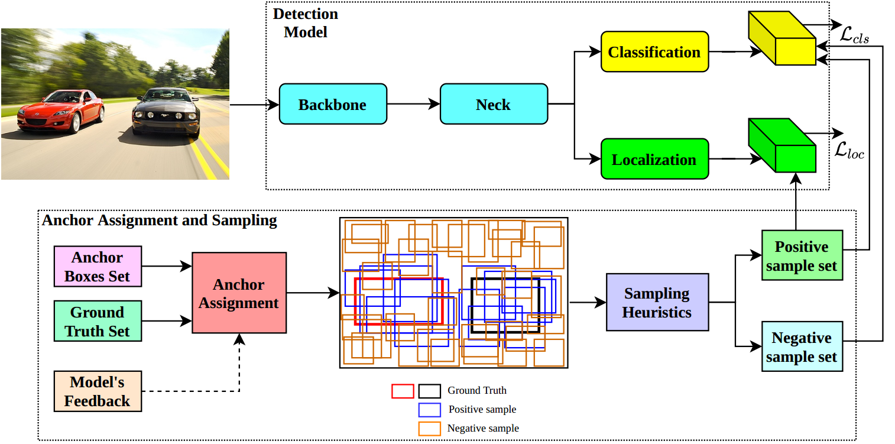

## A Review on Anchor Assignment and Sampling Heuristics in Deep Learning-based Object Detection

This repository provides a up-to-date paper list about anchor assigment, sampling heuristics and recent trends in object detection. This repository based on a problem-based taxonomy in the following paper: "A Review on Anchor Assignment and Sampling Heuristics in Deep Learning-based Object Detection"- [[Paper]](https://www.sciencedirect.com/science/article/abs/pii/S092523122200861X?via%3Dihub)
## How to add new papers to this repository
If you find a new paper that relates to anchor assignment, sampling methods as well as new trends in object detection. Please feel free to make a pull request.
## News

## Table of Contents
1. [Anchor Assignment Methods](#1)  
    1.1 [Hard Anchor Assignment](#1.1)  
    1.2 [Soft Anchor Assignment](#1.2)     
2. [Sampling Methods](#2)  
    2.1 [Hard Sampling](#2.1)    
    2.2 [Soft Sampling](#2.2)  
3. [Recent Trends in Object Detection](#3)  
    3.1 [Transformer-based Detection Head](#3.1)  
    3.2 [Transformer-based Feature Extractor](#3.2)  


## 1. Anchor Assignment Methods <a name="1"></a>
#### 1.1. Hard Anchor Assignment <a name="1.1"></a>
  - Focal Loss for Dense Object Detection, ICCV 2017. [[Paper]](https://openaccess.thecvf.com/content_ICCV_2017/papers/Lin_Focal_Loss_for_ICCV_2017_paper.pdf)
  - FCOS: Fully Convolutional One-Stage Object Detection, ICCV 2019. [[Paper]](https://openaccess.thecvf.com/content_ICCV_2019/papers/Tian_FCOS_Fully_Convolutional_One-Stage_Object_Detection_ICCV_2019_paper.pdf)
  - Bridging the Gap Between Anchor-based and Anchor-free Detection via Adaptive Training Sample Selection, CVPR 2020. [[Paper]](https://openaccess.thecvf.com/content_CVPR_2020/papers/Zhang_Bridging_the_Gap_Between_Anchor-Based_and_Anchor-Free_Detection_via_Adaptive_CVPR_2020_paper.pdf)
  - You Only Look One-level Feature, CVPR 2021. [[Paper]](https://openaccess.thecvf.com/content/CVPR2021/papers/Chen_You_Only_Look_One-Level_Feature_CVPR_2021_paper.pdf)
#### 1.2. Soft Anchor Assignment <a name="1.2"></a>
  - FreeAnchor: Learning to Match Anchors for Visual Object Detection, NeurIPS 2019. [[Paper]](https://proceedings.neurips.cc/paper/2019/file/43ec517d68b6edd3015b3edc9a11367b-Paper.pdf)
  - Learning from Noisy Anchors for One-stage Object Detection, CVPR 2020. [[Paper]](https://openaccess.thecvf.com/content_CVPR_2020/papers/Li_Learning_From_Noisy_Anchors_for_One-Stage_Object_Detection_CVPR_2020_paper.pdf)
  - Multiple Anchor Learning for Visual Object Detection, CVPR 2020. [[Paper]](https://openaccess.thecvf.com/content_CVPR_2020/papers/Ke_Multiple_Anchor_Learning_for_Visual_Object_Detection_CVPR_2020_paper.pdf)
  - AutoAssign: Differentiable Label Assignment for Dense Object Detection, arXiv 2020. [[Paper]](https://arxiv.org/pdf/2007.03496.pdf)
  - Probabilistic Anchor Assignment with IoU Prediction for Object Detection, ECCV 2020. [[Paper]](https://www.ecva.net/papers/eccv_2020/papers_ECCV/papers/123700358.pdf)
  - End-to-End Object Detection with Transformers, ECCV 2020. [[Paper]](https://www.ecva.net/papers/eccv_2020/papers_ECCV/papers/123460205.pdf)
  - End-to-End Object Detection with Fully Convolutional Network, CVPR 2021. [[Paper]](https://openaccess.thecvf.com/content/CVPR2021/papers/Wang_End-to-End_Object_Detection_With_Fully_Convolutional_Network_CVPR_2021_paper.pdf)
  - LLA: Loss-aware label assignment for dense pedestrian detection, Neurocomputing 2021. [[Paper]](https://www.sciencedirect.com/science/article/pii/S0925231221011796)
  - OTA: Optimal Transport Assignment for Object Detection, CVPR 2021. [[Paper]](https://openaccess.thecvf.com/content/CVPR2021/papers/Ge_OTA_Optimal_Transport_Assignment_for_Object_Detection_CVPR_2021_paper.pdf)
  - What Makes for End-to-End Object Detection?, ICML 2021. [[Paper]](http://proceedings.mlr.press/v139/sun21b/sun21b.pdf)
  - YOLOX: Exceeding YOLO Series in 2021, arXiv 2021. [[Paper]](https://arxiv.org/pdf/2107.08430.pdf)
  - TOOD: Task-aligned One-stage Object Detection, ICCV 2021. [[Paper]](https://openaccess.thecvf.com/content/ICCV2021/papers/Feng_TOOD_Task-Aligned_One-Stage_Object_Detection_ICCV_2021_paper.pdf)
  - Mutual Supervision for Dense Object Detection, ICCV 2021. [[Paper]](https://arxiv.org/pdf/2109.05986.pdf)
  - Improving Object Detection by Label Assignment Distillation, WACV 2022. [[Paper]](https://arxiv.org/pdf/2108.10520.pdf)
  - A Dual Weighting Label Assignment Scheme for Object Detection, CVPR 2022. [[Paper]](https://arxiv.org/pdf/2203.09730.pdf)
  - ObjectBox: From Centers to Boxes for Anchor-Free Object Detection, ECCV 2022. [[Paper]](https://arxiv.org/pdf/2207.06985v1.pdf)
## 2. Sampling Methods <a name="2"></a>
#### 2.1. Hard Sampling <a name="2.1"></a>
  - Rich Feature Hierarchies for Accurate Object Detection and Semantic Segmentation, CVPR 2014. [[Paper]](https://www.cv-foundation.org/openaccess/content_cvpr_2014/papers/Girshick_Rich_Feature_Hierarchies_2014_CVPR_paper.pdf)
  - Fast R-CNN, ICCV 2015. [[Paper]](https://www.cv-foundation.org/openaccess/content_iccv_2015/papers/Girshick_Fast_R-CNN_ICCV_2015_paper.pdf)
  - Faster R-CNN: Towards Real-Time Object Detection with Region Proposal Networks, NeurIPS 2015. [[Paper]](https://papers.nips.cc/paper/2015/file/14bfa6bb14875e45bba028a21ed38046-Paper.pdf)
  - SSD: Single Shot MultiBox Detector, ECCV 2016. [[Paper]](https://arxiv.org/pdf/1512.02325.pdf)
  - Training Region-based Object Detectors with Online Hard Example Mining, CVPR 2016. [[Paper]](https://openaccess.thecvf.com/content_cvpr_2016/papers/Shrivastava_Training_Region-Based_Object_CVPR_2016_paper.pdf)
  - Libra R-CNN: Towards Balanced Learning for Object Detection, CVPR 2019. [[Paper]](https://openaccess.thecvf.com/content_CVPR_2019/papers/Pang_Libra_R-CNN_Towards_Balanced_Learning_for_Object_Detection_CVPR_2019_paper.pdf)
  - Overlap Sampler for Region-Based Object Detection, WACV 2020. [[Paper]](https://openaccess.thecvf.com/content_WACV_2020/papers/Chen_Overlap_Sampler_for_Region-Based_Object_Detection_WACV_2020_paper.pdf)
#### 2.2. Soft Sampling <a name="2.2"></a>
  - Focal Loss for Dense Object Detection, ICCV 2017. [[Paper]](https://openaccess.thecvf.com/content_ICCV_2017/papers/Lin_Focal_Loss_for_ICCV_2017_paper.pdf)
  - Is Heuristic Sampling Necessary in Training Deep Object Detectors?, TIP 2021. [[Paper]](https://ieeexplore.ieee.org/stamp/stamp.jsp?tp=&arnumber=9526287)
  - Gradient Harmonized Single-stage Detector, AAAI 2019. [[Paper]](https://arxiv.org/pdf/1811.05181.pdf)
  - Prime Sample Attention in Object Detection, CVPR 2020. [[Paper]](https://openaccess.thecvf.com/content_CVPR_2020/papers/Cao_Prime_Sample_Attention_in_Object_Detection_CVPR_2020_paper.pdf)
  - Generalized Focal Loss: Learning Qualified and Distributed Bounding Boxes for Dense Object Detection, NeurIPS 2020. [[Paper]](https://arxiv.org/pdf/2006.04388.pdf)
  - Learning a Unified Sample Weighting Network for Object Detection, CVPR 2020. [[Paper]](https://openaccess.thecvf.com/content_CVPR_2020/papers/Cai_Learning_a_Unified_Sample_Weighting_Network_for_Object_Detection_CVPR_2020_paper.pdf)
  - Equalization Loss for Long-Tailed Object Recognition, CVPR 2020. [[Paper]](https://arxiv.org/pdf/2003.05176.pdf)
  - Equalization Loss v2: A New Gradient Balance Approach for Long-tailed Object Detection, CVPR 2021. [[Paper]](https://arxiv.org/pdf/2012.08548.pdf)
  - VarifocalNet: An IoU-aware Dense Object Detector, CVPR 2021. [[Paper]](https://openaccess.thecvf.com/content/CVPR2021/papers/Zhang_VarifocalNet_An_IoU-Aware_Dense_Object_Detector_CVPR_2021_paper.pdf)
## 3. Recent Trends in Object Detection <a name="3"></a>
#### 3.1. Transformer-based Detection Head <a name="3.1"></a>
  - End-to-End Object Detection with Transformers, ECCV 2020. [[Paper]](https://www.ecva.net/papers/eccv_2020/papers_ECCV/papers/123460205.pdf)
  - Deformable DETR: Deformable Transformers for End-to-End Object Detection, ICML 2021. [[Paper]](https://openreview.net/forum?id=gZ9hCDWe6ke)
  - End-to-End Object Detection with Adaptive Clustering Transformer, BMVC 2021. [[Paper]](https://arxiv.org/pdf/2011.09315.pdf)
  - Fast Convergence of DETR with Spatially Modulated Co-Attention, ICCV 2021. [[Paper]](https://openaccess.thecvf.com/content/ICCV2021/papers/Gao_Fast_Convergence_of_DETR_With_Spatially_Modulated_Co-Attention_ICCV_2021_paper.pdf)
  - Conditional DETR for Fast Training Convergence, ICCV 2021. [[Paper]](https://openaccess.thecvf.com/content/ICCV2021/papers/Meng_Conditional_DETR_for_Fast_Training_Convergence_ICCV_2021_paper.pdf)
  - PnP-DETR: Towards Efficient Visual Analysis with Transformers, ICCV 2021. [[Paper]](https://openaccess.thecvf.com/content/ICCV2021/papers/Wang_PnP-DETR_Towards_Efficient_Visual_Analysis_With_Transformers_ICCV_2021_paper.pdf)
  - Dynamic DETR: End-to-End Object Detection with Dynamic Attention, ICCV 2021. [[Paper]](https://openaccess.thecvf.com/content/ICCV2021/papers/Dai_Dynamic_DETR_End-to-End_Object_Detection_With_Dynamic_Attention_ICCV_2021_paper.pdf)
  - Rethinking Transformer-based Set Prediction for Object Detection, ICCV 2021. [[Paper]](https://openaccess.thecvf.com/content/ICCV2021/papers/Sun_Rethinking_Transformer-Based_Set_Prediction_for_Object_Detection_ICCV_2021_paper.pdf)
  - WB-DETR: Transformer-Based Detector Without Backbone, ICCV 2021. [[Paper]](https://openaccess.thecvf.com/content/ICCV2021/papers/Liu_WB-DETR_Transformer-Based_Detector_Without_Backbone_ICCV_2021_paper.pdf)
  - UP-DETR: Unsupervised Pre-training for Object Detection with Transformers, ICCV 2021. [[Paper]](https://arxiv.org/pdf/2011.09094.pdf)
  - Efficient DETR: Improving End-to-End Object Detector with Dense Prior, arXiv 2021. [[Paper]](https://arxiv.org/pdf/2104.01318.pdf)
  - ViDT: An Efficient and Effective Fully Transformer-based Object Detector, ICLR 2022. [[Paper]](https://arxiv.org/pdf/2110.03921.pdf)
  - Anchor DETR: Query Design for Transformer-Based Detector, AAAI 2022. [[Paper]](https://arxiv.org/pdf/2109.07107.pdf)
  - You Only Look at One Sequence: Rethinking Transformer in Vision through Object Detection, NeurIPS 2021. [[Paper]](https://arxiv.org/pdf/2106.00666.pdf)
  - Sparse DETR: Efficient End-to-End Object Detection with Learnable Sparsity, ICLR 2022. [[Paper]](https://arxiv.org/pdf/2111.14330.pdf)
  - Accelerating DETR Convergence via Semantic-Aligned Matching, CVPR 2022. [[Paper]](https://arxiv.org/pdf/2203.06883v1.pdf)
  - DN-DETR: Accelerate DETR Training by Introducing Query DeNoising, CVPR 2022. [[Paper]](https://arxiv.org/pdf/2203.01305.pdf)
  - DINO: DETR with Improved DeNoising Anchor Boxes for End-to-End Object Detection, arXiv 2022. [[Paper]](https://arxiv.org/pdf/2203.03605v1.pdf)
  - AdaMixer: A Fast-Converging Query-Based Object Detector, CVPR 2022. [[Paper]](https://arxiv.org/pdf/2203.16507v2.pdf)
#### 3.2. Transformer-based Feature Extractor <a name="3.2"></a>
  - Pyramid Vision Transformer: A Versatile Backbone for Dense Prediction without Convolutions, ICCV 2021. [[Paper]](https://openaccess.thecvf.com/content/ICCV2021/papers/Wang_Pyramid_Vision_Transformer_A_Versatile_Backbone_for_Dense_Prediction_Without_ICCV_2021_paper.pdf)
  - PVTv2: Improved Baselines with Pyramid Vision Transformer, CVMJ 2022. [[Paper]](https://arxiv.org/pdf/2106.13797.pdf)
  - Swin Transformer: Hierarchical Vision Transformer using Shifted Windows, ICCV 2021. [[Paper]](https://openaccess.thecvf.com/content/ICCV2021/papers/Liu_Swin_Transformer_Hierarchical_Vision_Transformer_Using_Shifted_Windows_ICCV_2021_paper.pdf)
  - Swin Transformer V2: Scaling Up Capacity and Resolution, arXiv 2021. [[Paper]](https://arxiv.org/pdf/2111.09883.pdf)
  - Multi-Scale Vision Longformer: A New Vision Transformer for High-Resolution Image Encoding, ICCV 2021. [[Paper]](https://openaccess.thecvf.com/content/ICCV2021/papers/Zhang_Multi-Scale_Vision_Longformer_A_New_Vision_Transformer_for_High-Resolution_Image_ICCV_2021_paper.pdf)
  - Focal Self-attention for Local-Global Interactions in Vision Transformers, NeurIPS 2021. [[Paper]](https://arxiv.org/pdf/2107.00641.pdf)
  - CSWin Transformer: A General Vision Transformer Backbone with Cross-Shaped Windows, CVPR 2022. [[Paper]](https://arxiv.org/pdf/2107.00652.pdf)
  - MobileViT: Light-weight, General-purpose, and Mobile-friendly Vision Transformer, ICLR 2022. [[Paper]](https://arxiv.org/pdf/2110.02178.pdf)
  - Twins: Revisiting the Design of Spatial Attention in Vision Transformers, NeurIPS 2021. [[Paper]](https://papers.nips.cc/paper/2021/file/4e0928de075538c593fbdabb0c5ef2c3-Paper.pdf)
  - ResT: An Efficient Transformer for Visual Recognition, NeurIPS 2021. [[Paper]](https://arxiv.org/pdf/2105.13677.pdf)
  - Transformer in Transformer, NeurIPS 2021. [[Paper]](https://papers.nips.cc/paper/2021/file/854d9fca60b4bd07f9bb215d59ef5561-Paper.pdf)
  - Quadtree Attention for Vision Transformer, ICLR 2022. [[Paper]](https://arxiv.org/pdf/2201.02767.pdf)
  - MPViT: Multi-Path Vision Transformer for Dense Prediction, CVPR 2022. [[Paper]](https://arxiv.org/pdf/2112.11010.pdf)
  
## Contact
If you have any question, please contact Xuan-Thuy Vo, email: xthuy@islab.ulsan.ac.kr or cite my paper:
```BibTeX
@article{VO2022,
title = {A Review on Anchor Assignment and Sampling Heuristics in Deep Learning-based Object Detection},
journal = {Neurocomputing},
year = {2022},
issn = {0925-2312},
doi = {https://doi.org/10.1016/j.neucom.2022.07.003},
url = {https://www.sciencedirect.com/science/article/pii/S092523122200861X},
author = {Xuan-Thuy Vo and Kang-Hyun Jo}
}
```
